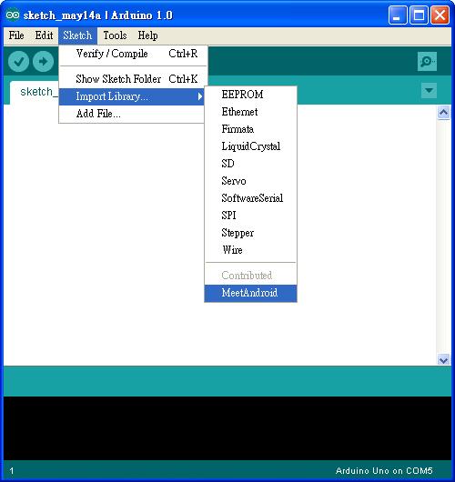
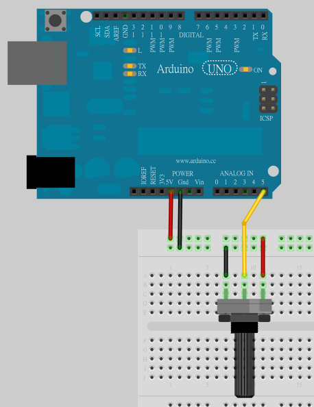
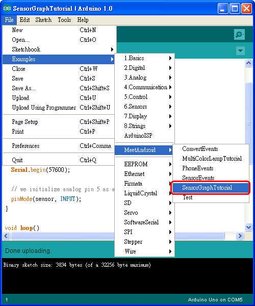
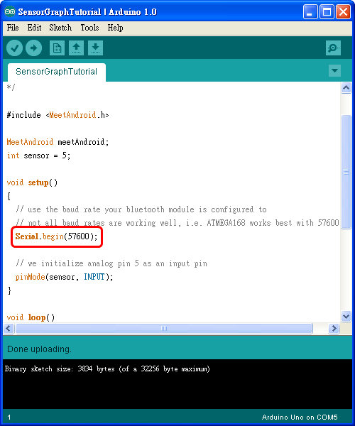
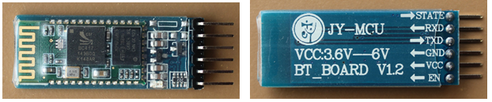
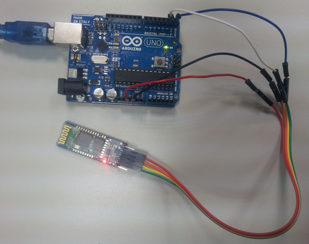
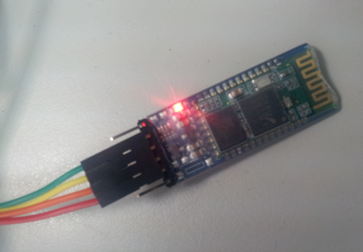
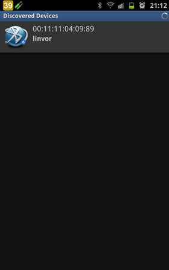
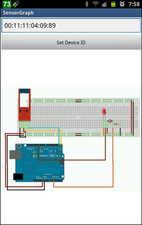
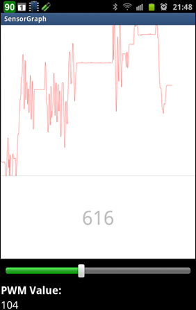

## Arduino入門教學(15) – Amarino 的 SensorGraph 範例程式 (作者：Cooper Maa)

這篇是寫給 amarino 初學者看的，目的是教導你如何執行 Amarino 的 SensorGraph 範例程式。

### 所需材料

* Android 手機一支
* Arduino x1
* bluetooth module x 1
* 可變電阻或光敏電阻 (Light dependent resistor) x 1

### Step 1：安裝 Amarino

到 <http://www.amarino-toolkit.net/> 下載下列 App 並安裝到 Android 手機上：

1) [Amarino](http://code.google.com/p/amarino/downloads/detail?name=Amarino_2_v0_55.apk&can=2&q=)

2) [Amarino Plug-in Bundle](http://code.google.com/p/amarino/downloads/detail?name=AmarinoPluginBundle.apk&can=2&q=)

3) [SensorGraph](http://code.google.com/p/from-arduino-to-android-to-arduino/downloads/detail?name=SensorGraph-1.apk&can=2&q=) (這是 buildcircuit.com 的版本)

### Step 2: 安裝 Arduino IDE 與 MeetAndroid Library

如果你電腦上還沒有 Arduino IDE，請先到 <http://arduino.cc/en/Main/Software> 下載軟體，下載後解壓縮即可。

接著下載 [MeetAndroid Library](http://code.google.com/p/amarino/downloads/detail?name=MeetAndroid_4.zip&can=2&q=) ，把 MeetAndroid 解到 Arduino IDE 安裝目錄下的 libraries 資料夾下。

重新啟動 Arduino IDE，在 Sketch > Import Library 底下應該會看到 MeetAndroid，如下圖：

### Step 3：連接可變電阻或光敏電阻

參考下圖，把可變電阻中間腳位接到 Analog Input pin 5，剩下的兩支腳位，一支接到 5V，另外一支接到 GND：

如果你使用的是光敏電阻，電路的接法請參考 [這篇](http://coopermaa2nd.blogspot.com/2010/12/arduino-lab8-led.html) 。

### Step 4： 上傳 SensorGraph Tutorial 程式

點 File > Examples > MeetAndroid > SensorGraph Tutorial 打開 SensorGraph Tutorial 程式：

程式所用的 baud rate 預設是 57600 bps，如果你的藍芽模組不是 57600 bps，請做適當的調整：

然後把程式上傳到 Arduino 板子上。

### Step 5：連接藍芽模組

我用的是 [廣州匯承信息科技](http://www.wavesen.com/) 的 HC-0x 系列藍芽模組，下圖是 HC-0x 藍芽模組的外觀：

這個藍芽模組連接方法很簡單，照下表把 Arduino 和藍芽模組連接起來就好：

Arduino    藍芽模組        備註
-------    -------------   -----------------------
5V         VCC             注意電源不可接錯
GND        GND             注意電源不可接錯
RXD        TXD         
TXD        RXD         

連接的時候有兩點要注意：第一是電源千萬不可接錯，不然可能會把藍芽模組燒壞，第二是 Arduino 的 RXD 要接藍芽模組的 TXD，而 Arduino 的 TXD 要接藍芽模組的 RXD。

通電之後，藍芽模組上的 LED 會一直閃爍：

### Step 6：執行 SensorGraph App

首先，先利用 Amarino 搜尋藍芽設備，找到設備後，將藍芽設備的 MAC Address 抄起來（ *記得不要在 Amarino 設定任何 Event！* ）：

打開 SensorGraph App，輸入剛剛抄下來的 MAC Address，然後按下【Set Device ID】：

如果一切順利，Android 手機就會跟 Arduino 建立連線，並且呈現如下圖的畫面。其中，畫面上方會繒製感測讀值的圖形，而下方則顯示其即時數值（至於最底下的 SeekBar，因為我們沒有用到，所以可以忽略不管）：

### 示範影片

* [示範影片：sensor graph with LED controller](http://www.youtube.com/watch?v=gn_-OjxvRjk)

### 參考資料

* [SensorGraph using Android, Amarino and Arduino](http://www.buildcircuit.com/sensorgraph-using-android-amarino-and-arduino/)
* [Sensor Graph](http://www.bygriz.com/portfolio/sensor-graph/#more-1344)
* [以 Amarino 連接 Android 與 Arduino](http://coopermaa2nd.blogspot.tw/2012/06/amarino-android-arduino.html)

【本文作者為馬萬圳，原文網址為： <http://coopermaa2nd.blogspot.tw/2012/06/sensorgraph.html> ，由陳鍾誠編輯後納入本雜誌】

