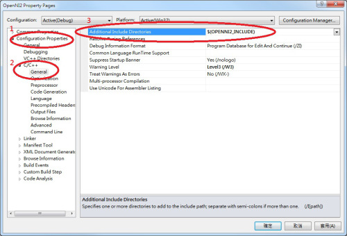
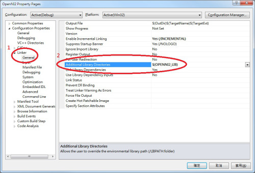
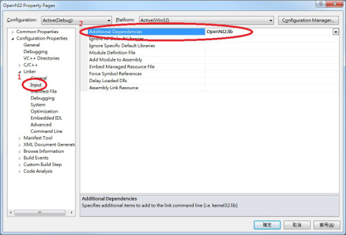

## OpenNI 2 基本程式範例 (作者： Heresy Ku )

在前一篇 [《OpenNI 2 簡介》](http://kheresy.wordpress.com/2012/12/21/basic-openni-2/) 裡，Heresy 大概解釋了 OpenNI 2.0 的基本功能以及他的架構。而接下來的這一篇，就是要來講怎麼寫 OpenNI 2 的程式了～如果是要了解 OpenNI 1.x 版的程式開發的話，請參考 [《OpenNI 1.x 教學文章》](http://kheresy.wordpress.com/index_of_openni_and_kinect/documents-of-openni-1-x/) 這系列的文章。

首先，在安裝好 OpenNI 2.0 的 SDK 後，在安裝目錄（預設是 C:\Program Files\OpenNI2\）裡面，會有下列的資料夾：

目錄            用途                                      32 位元                  64 位元
--------------  --------------------------------------    ---------------------    ----------------------
Documentation   OpenNI SDK 開發程式的參考文件         
Driver          官方支援硬體的驅動程式         
Include         程式開發時必須的 header 檔                `$(OPENNI2_INCLUDE)`     `$(OPENNI2_INCLUDE64)`
Lib             程式開發時必須的 lib 檔                   `$(OPENNI2_LIB)`         `$(OPENNI2_LIB64)`
Redist          程式執行時必須的 runtime library（dll）   `$(OPENNI2_REDIST)`      `$(OPENNI2_REDIST64)`
Samples         範例程式         
Tools           工具，目前只有 NiViewer         

### VisualStudio 2010 專案設定

而如果是使用 Visual Studio 2010 來開發 OpenNI 2 的程式的話，基本上要在新建立的專案、或是現有專案裡，針對 including 和 linking 做設定，他的基本方法如下（附註 1）：

1. 在專案上方點滑鼠右鍵，點選跳出選單最底下的「Properties」（屬性），叫出專案設定的視窗。 （[中文版畫面](http://kheresy.files.wordpress.com/2012/12/open2_pro_ch.jpg) 、[英文版畫面](http://kheresy.files.wordpress.com/2012/12/open2_pro_en.jpg) ）
2. 在左側導覽窗格中的「 *Configuration Properties* 」（組態屬性）下，可以找到「 *C/C++* 」，點開後選擇第一項的「 *Gerenal* 」（一般）後，右側的列表會有一個「 *Additional Include Directories* 」（其他 Include 目錄）。 
要使用 OpenNI 2 的話，就需要在這裡面加入 OpenNI 2 的 header 檔所在的路徑，如果是 32 位元的專案，就是加上 `$(OPENNI2_INCLUDE)` ，如果是 64 位元的專案，則是加上 *`$(OPENNI2_INCLUDE64)`* 。 （附註 2）



3.  在左側導覽窗格中，剛剛的「C/C++」下方會有一個「Linker」（連結器），點開後，裡面第一個會是「Gerenal」（一般），點選之後，在右側可以找到「Additional Library Directories」（其他程式庫目錄）。 
在這裡面加入 OpenNI 2 的 lib 檔、也就是 OpenNI2.lib 這個檔案的所在的路徑，如果是 32 位元的專案，就是加上 `$(OPENNI2_LIB)` ，如果是 64 位元的專案，則是加上 `$(OPENNI2_LIB64)`。
 


4. 接下來，在左側的「Linker」（連結器）下，「General」（一般）的下面會有一個「Input」（輸入），點選後右邊可以找到「Additional Dependencies」（其他相依性）；在這邊加入 OpenNI 2.0 的 lib 檔檔案名稱，也就是「OpenNI2.lib」。
 


這樣，基本的專案設定就完成了。

要注意的是，在 Visual Studio 裡，不同的建置組態，例如 debug、release、Win32、x64，這些設定都是不同的～所以如果變更建置組態後，這些設定也是需要另外設定的。
另外，在執行時要注意的是，OpenNI 2 的運作模式和 OpenNI 1.x 不一樣，所以它是設計成讓每個應用程式，可以個別擁有各自的 runtime library（dll 檔）等檔案，所以要執行的時候，就必須要讓程式找的到 OpenNI 2 安裝資料夾中，Redist 目錄下的檔案，否則程式執行時，就會出現找不到 OpenNI2.dll 的錯誤（如下圖）。這點，其實算是比較接近一般 C++ 函式庫的使用方法的。
在 Windows 下，基本上應用程式在執行的時候，會優先去找程式執行的目錄下、是否有所需要的 dll 檔；所以最簡單的方法，就是把 Redist 目錄下所有的檔案，都複製一份到程式執行檔所在目錄就可以了。


不過如果是在 Visual Srudio 裡面進行開發的話，由於 VisualStduio 是可以設定執行時的工作目錄的，而工作目錄並不一定會是執行檔所在的路徑（預設不是），所以直接把 Redist 目錄下的檔案複製到執行檔所在路徑，在進行偵錯的時候並不一定有用。

而要確定 Visual Studio 的工作路徑在哪，可以透過點選專案、按右鍵後選擇右鍵選單的「Properties」（屬性），然後在左側選擇「Configuration Properties」（組態屬性）底下的「Debugging」（偵錯）；這之後右邊會有「Working Directory」（工作目錄），他的值就代表了在透過 VisualStudio 針對這個專案進行偵錯時，他的工作目錄（英文版螢幕截圖、中文版螢幕截圖）。而如果是 Visual Studio 的預設值的話，他的值應該是「 `$(ProjectDir)` 」，也就是專案所在目錄（vcxproj 檔所在的地方）。

這時候可以採取的方法主要有幾種：

1. 將 OpenNI2 Redist 目錄下所有的檔案，都複製到專案所在目錄。
2. 修改 VisualStudio 偵錯階段的工作路徑，例如修改成 `$(OPENNI2_REDIST)` 。
3. 將 `$(OPENNI2_REDIST)` 加入到系統路徑（參考）。

哪種方法好？基本上是看狀況，見仁見智的。由於很多時候，程式還會用到其他函式庫，也有可能會需要用到他們各自的 dll 檔，所以把這些 dll 檔統一放在一起，其實也是一種解決方案。

### 基礎流程

在專案設定好後，要使用 OpenNI 2 來讀取感應器的資料的話，他的基本流程，大致如下：

1. `include OpenNI.h` 這個檔案。之後，`OpenNI C++ API` 的東西，都會在 openni 這個 namespace 下。
2. 呼叫 `openni::OpenNI::initialize()` 這個函式來完成 OpenNI 2 環境的初始化。
3. 宣告一個 `openni::Device` 的物件，並透過他所提供的 `open()` 這個函式，來完成裝置初始化。
	* 3.1 如果有多個裝置，想要指定要用哪個裝置的話，需要先透過 `openni::OpenNI::enumerateDevices()` 這個函式，來取得可使用的裝置列表，再透過指定 URI 的方式，來指定要開啟哪個裝置。
	* 3.2 如果沒有要特別指定的話，則是以 `openni::ANY_DEVICE` 當作 URI，讓系統自動決定要使用哪個裝置。
4. 建立 `openni::VideoStream` 的物件，透過他的 `create()` 這個函式，指定這個 video stream 要使用哪個裝置的哪種感應器（紅外線、彩色影像、深度影像）。 建立完成後，則是可以透過 `start()` 和 `stop()`，來控制資料的讀取。
5. 進入主迴圈，如果要讀取 video stream 當下的資料的話，則是呼叫 VideoStream 所提供的 `readFrame()` 這個函式，來把資料寫到 openni::VideoFrameRef 裡；而之後則是再透過 VideoFrameRef 所提供的函式，來做資料處理。
6. 當不再需要使用感應器的資料的時候，要記得關閉所建立出來的資料。
	* 6.1 呼叫 `openni::VideoStream` 的 `destory()` 這個函式，關閉 video stream。
	* 6.2 呼叫 `openni::Device` 的 `close()`，關閉裝置。
7. 最後，則是呼叫 `openni::OpenNI::shutdown()`，來關閉整個 OpenNI 的環境。

### 簡單的範例

上面是用文字來做描述，實際上寫成程式碼，就會類似 OpenNI 官方所提供的「SimpleRead」這個範例一樣（預設位置在 `C:\Program Files\OpenNI2\Samples\SimpleRead` ）。而下面，Heresy 則是在把程式碼做進一步的簡化（主要是刪掉錯誤偵測的部分），變成：

```CPP
// STL Header
#include <iostream>
 
// 1. include OpenNI Header
#include "OpenNI.h"
 
int main( int argc, char** argv )
{
  // 2. initialize OpenNI
  openni::OpenNI::initialize();
   
  // 3. open a device
  openni::Device devAnyDevice;
  devAnyDevice.open( openni::ANY_DEVICE );
   
  // 4. create depth stream
  openni::VideoStream streamDepth;
  streamDepth.create( devAnyDevice, openni::SENSOR_DEPTH );
  streamDepth.start();
   
  // 5 main loop, continue read
  openni::VideoFrameRef frameDepth;
  for( int i = 0; i < 100; ++ i )
  {
    // 5.1 get frame
    streamDepth.readFrame( &frameDepth );
     
    // 5.2 get data array
    const openni::DepthPixel* pDepth 
            = (const openni::DepthPixel*)frameDepth.getData();
     
    // 5.3 output the depth value of center point
    int idx = frameDepth.getWidth() * ( frameDepth.getHeight() + 1 ) / 2;
    std::cout << pDepth[idx] << std::endl;
  }
   
  // 6. close
  streamDepth.destroy();
  devAnyDevice.close();
   
  // 7. shutdown
  openni::OpenNI::shutdown();
   
  return 0;
}
```

程式碼的內容，大致上就如同上一個段落所說明的，所以基本上這邊就只針對部分地方做補充的說明。
首先是第四部份，建立 VideoStream 的部分。這邊基本上是透過 VideoStream 物件（devAnyDevice）本身的 `create()` 函式，來指定這個 video stream 要使用哪個裝置的哪種感應器；在這個例子裡，所使用的是 `openni::SENSOR_DEPTH`，也就是深度感應器的部分。而在目前的 OpenNI 2 裡，除了 SENSOR_DEPTH 外，還有對應到彩色影像的 SENSOR_COLOR，以及對應到紅外線影像的 SENSOR_IR 可以使用。

而在資料讀取、也就是「5」的部分，在透過 VideoStream 的 `readFrame(`) 這個函式，把這個時間點的影像資料，寫到 VideoFrameRef 後，要讀取深度資料，就是要透過 VideoFrameRef 的物件（frameDepth）來做存取了～在一般狀況下，主要是透過他的 getWidth() 和 getHeight() 這兩個函式，來取得這個影像的大小。而透過 getData()，則可以取得這個影像的資料；他所回傳的型別，是無型別的指標、 `void*` ，實際上是指到一個儲存影像資料的陣列的指標。
由於 OpenNI 2 把影像資料的讀取統一化了，同時也把 OpenNI 1.x 的 MapMetaData 的概念拿掉了，所以在資料的讀取上，會變得比較「低階」一點。首先，如果要做資料的讀取，需要自己根據影像的類型，來做轉型的動作。像在這邊由於是使用深度感應器，影像中每一個像素的資料型別都是 `openni::DepthPixel`；所以在這邊，就是需要把 `void*` 強制轉型成為 DepthPixel 的指標來使用（上方範例 5.2 的部分）（附註 3）。

經過這樣的處理，pDpeth 就是一個指到這張深度影像資料的一維振烈的指標，而這個陣列的大小，就是他的寬（透過 `getWidth()` 取得）乘上高（透過 `getHieght()` 取得）；如果是 `640 x 480` 的話，pDpeth 所指到的陣列，大小就是 `640 x480 = 307,200` 了～而其中每一項，都代表一個點的深度；如果是要取得 ( x, y ) 這個點的值的話，就是要做一個簡單的座標換算，去取得他在陣列中的 index。這個基本的換算公式，就是：

> int idx = x + y * width;

只要把 x 和 y 帶入上面的公式，就可以簡單地算出每一個點在陣列中的位置，並取出他的值了。
而如果是要使用彩色影像的話，他預設的型別是 `openni::RGB888Pixel` 這個 structure，裡面是以三個 unsigned char 的變數，分別儲存著 RGB 三種顏色的值；而如果是紅外線影像的話，型別則是 `openni::Grayscale16Pixel` ，實際型別則是和 DepthPixel 一樣，是 unsigned short。

### 小結
這篇算是 OpenNI 2 的第一篇教學文章，就先寫到這了～這邊的範例，基本上應該就算是一個算是最簡單，透過 OpenNI 2 來做深度資料讀取的範例了；其中有很大的篇幅，其實是在講如何設定專案就是了。

而這個範例程式在執行後，會讀取深度感應器的 100 個畫面，並把影像中樣的深度值做輸出，所以在執行後，會看到畫面上有一堆數字出現；由於這部分的程式並沒有繪圖的部分，所以執行後只會看到一串數字，是不會有影像出現的。

實際上，這個範例程式比較好的寫法，應該還是要像官方的「SimpleRead」這個範例一樣，加上錯誤偵測會更好，不過這邊為了篇幅，還是先把它拿掉了。而另外，這邊基本上是只針對單一個 video stream 做操作的寫法，如果是要同時讀取的彩色影像和深度影像的話，則可能還要再做一點的修改。

接下來…就期待下一篇文章吧～

### 附註

1. 這邊的英文版是 Visual Studio 2010 的畫面、文字，中文版則是 Visual Studio 2012 的畫面與文字；不同的版本、不同的設定，選項可能會不盡相同，請自行根據狀況調整。
如果有多個項目的話，可以用「;」做區隔。
2. 在 OpenNI 2 裡面，透過 Kinect 或 Xtion 取得的深度影像的每一個像素、DepthPixel 的單位，預設應該還是一樣是「mm」（公釐、毫米）；不過實際上，他也有定義了幾種不同的 PixelFormat，代表其實是有可能可以娶到其他單位的深度的～所以其實要比較保險一點的話，還是得檢查 VideoMode 裡的 PixelFormat，才能確定 DepthPixel 代表的意義。

【本文來自 Heresy's Space 的網誌，原文網址為： <http://kheresy.wordpress.com/2012/12/24/openni2-basic-example/> ，由 Heresy 捐出網誌給程式人雜誌，經陳鍾誠編輯後納入雜誌】
