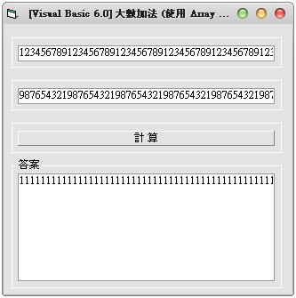
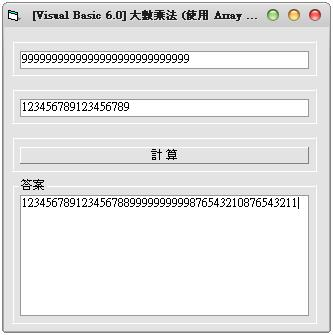

## Visual Basic 6.0:大整數運算 加法與乘法 (使用 Array 字串) (作者：廖憲得 0xde)

### 大整數加法



```monobasic
Private Sub Command1_Click()
    Text3 = ""
    ReDim TempArray(999)
    
    K = 0
    
    For i = Len(Text1) To 1 Step -1
        TempArray(K) = Mid(Text1, i, 1)
        K = K + 1
    Next i
    
    K = 0
    
    For i = Len(Text2) To 1 Step -1
        Temp = Val(TempArray(K)) + Val(Mid(Text2, i, 1))
        TempArray(K) = Temp Mod 10
        K = K + 1
        TempArray(K) = Val(TempArray(K)) + Val(Temp \ 10)
    Next i
        
    For i = 0 To UBound(TempArray)
        If Val(TempArray(i)) > 9 Then
            Temp = TempArray(i)
            TempArray(K) = Temp Mod 10
            K = K + 1
            TempArray(K) = Val(TempArray(K)) + Val(Temp \ 10)
        End If
    Next i
        
    For i = UBound(TempArray) To 0 Step -1
        Text3 = Text3 & TempArray(i)
    Next i
    
    Do Until Val(Mid(Text3, 1, 1)) <> 0
        Text3 = Mid(Text3, 2)
    Loop
End Sub
```

* 原始碼下載： [大數運算-大數加法.rar](http://files.dotblogs.com.tw/0xde/1311/20131113113943512.rar)


### 大整數乘法



```monobasic
Private Sub Command1_Click()
    Text3 = ""
    ReDim TempArray(999)
    
    K = 0
    
    For i = Len(Text1) To 1 Step -1
            NowIndex = K
        For j = Len(Text2) To 1 Step -1
            Temp = TempArray(NowIndex) + Mid(Text1, i, 1) * Mid(Text2, j, 1)
            TempArray(NowIndex + 1) = Temp \ 10 + TempArray(NowIndex + 1)
            TempArray(NowIndex) = Temp Mod 10
            NowIndex = NowIndex + 1
        Next j
            K = K + 1
    Next i
    
    For i = UBound(TempArray) To 0 Step -1
        Text3 = Text3 & TempArray(i)
    Next i
    
    Do Until Val(Mid(Text3, 1, 1)) <> 0
        Text3 = Mid(Text3, 2)
    Loop
End Sub

```

* 原始碼下載： [大數運算-大數乘法.rar](http://files.dotblogs.com.tw/0xde/1311/20131113112231481.rar)

【本文作者為「廖憲得」，原文網址為： <http://www.dotblogs.com.tw/0xde/archive/2013/11/13/129111.aspx> 與 <http://www.dotblogs.com.tw/0xde/archive/2013/11/13/129101.aspx> ，由陳鍾誠編輯後納入本雜誌】
