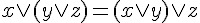
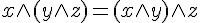
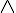
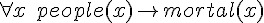

## 數學短訊：邏輯世界的歷史

### 簡介

邏輯學是西方科學中淵遠流長的一門學問，從西元前 350 年亞里斯多德的三段論開始，就開啟了歐洲文明對邏輯學的興趣之窗。然而這一個興趣同樣隨著西方文明的發展而起伏不定，直到西元 1850 年左右，George Boole (布爾) 開始研究布林代數，才讓邏輯學成為近代數學的一個重要領域。接著，Gottlob Frege 在 1870 年左右所提出的一階邏輯系統，繼承布林系統並向上延伸，形成一個數學基礎穩固且強大的邏輯系統，於是整個經典的邏輯系統建立完成。

雖然如此，這些邏輯系統仍然是掌上的玩物，而且沒有人能確定這樣的邏輯系統，其能力到底有多強，是否一致且完備，是否有某些極限。希爾伯特在 1900 年所提出的 25 個數學問題中，這個問題被排在第二個提出。然而，希爾伯特並沒有能證明一階邏輯系統的完備性，而是在 1929 年由哥德爾證明完成了。

哥德爾的成就不僅於此，1931 年他更進一步證明了一個非常令人驚訝的定理，在「一階邏輯的擴充系統 - 皮諾數論系統」當中，不具有完備性，而且它證明了假如該系統是完備的，將會導致矛盾。

哥德爾在證明完備定理與不完備定理時，採用的都是矛盾証法，也就是透過排中律所證明的，這樣的証明並非建構性的，因此即使建立了完備定理，也沒有人能構造出一個建構式的証明方法，可以檢證一階邏輯的定理。

1965 年，Robinson 提出了一條非常簡單的邏輯證明規則 -- Resolution，並且說明了如何利用矛盾檢證程序 Refutation，證明邏輯規則在某系統中的真假，這個方法既簡單又優美，因此廣為數學界與計算機科學界所稱道。以下，我們將更詳細的說明上述人物在邏輯學上的貢獻。

### 亞里斯多德 (Aristotle) (出生於西元前 322 年)

亞里斯多德在其其理則學 (zoology) 研究中，提出了下列的三段式推論規則 Barbara，簡稱為三段論。

| 類型   | 語句              | 說明     |
|--------|-------------------|----------|
| 大前提 | 所有人都終會死亡  | 普遍原理 |
| 小前提 | 蘇格拉底是人      | 特殊陳述 |
| 結論   | 蘇格拉底終會死亡  | 推論結果 |

### 布爾 (Boole) (出生於 1815年)

Boole 研究邏輯時，提出了一種只有真值與假值的邏輯，稱為二值邏輯，通常我們用 0 代表假值，1 代表真值。布爾研究這種邏輯系統，並寫出了一些代數規則，稱為布林代數，以下是其中的一些代數規則。

| 規則  (數學寫法)                                | 名稱          |
|-------------------------------------------------|---------------|
|            | OR 的結合律   |
|                              | OR 的交換律   |
|    | AND 的結合律  |
|                          | AND 的交換律  |
|           | 狄摩根定律(1) |
|           | 狄摩根定律(2) |

說明：上述規則中的    代表邏輯或 (AND) (在程式語言裏常寫為 `&` 或 and)，    代表邏輯或 (OR) (在程式語言裏常寫為 `|` 或 or)。所以若改用程式領域的寫法，可改寫如下。

| 規則  (數學寫法)            | 名稱          |
|-----------------------------|---------------|
| `x | (y | z) = (x | y) | z` | OR 的結合律   |
| `x | y = y | z`             | OR 的交換律   |
| `x & (y & z) = (x & y) & z` | AND 的結合律  |
| `x & y = y & x`             | AND 的交換律  |
| `-(x|y) = -x & -y`          | 狄摩根定律(1) |
| `-(x&y) = -x | -y`          | 狄摩根定律(2) |

### 福雷格 (Frege) (出生於 1848年)

Frege 在研究邏輯系統時，將函數的概念引入到邏輯系統當中，這種函數被稱為謂詞，因此該邏輯系統被稱為謂詞邏輯。然後，Frege 又引入了兩個量詞運算，    (對於所有) 與    (存在)，透過謂詞的限定作用，以及這兩個量詞，Frege 架構出了這種具有函數的邏輯系統，後來被稱為一階邏輯系統 (First Order Logic)。

以下是我們將亞里斯多德的三段論，轉化為一階邏輯後，所寫出的一階邏輯規則。

| 類型   | 語句                                               | 說明             |
|--------|----------------------------------------------------|------------------|
| 大前提 |     | 所有人都終會死亡 |
| 小前提 |                                    | 蘇格拉底是人     |
| 結論　 |                                    | 蘇格拉底終會死亡 |

### 希爾伯特 (David Hilbert) (出生於 1862年)

事實上，在電腦被發明之前，數學界早已開始探索「公理系統」的能力極限。在西元 1900 年時，德國的偉大數學家希爾伯特 (Hilbert)，提出了著名的 23 個數學問題，其中的第二個問題如下所示。

> 證明算術公理系統的無矛盾性 The compatibility of the arithmetical axioms.

在上述問題中，希爾伯特的意思是要如何證明算術公理系統的 Compatibility，Compatibility 這個詞意謂著必須具有「一致性」 (Consistency) 與「完備性」(Completeness)。

所謂的「一致性」，是指公理系統本身不會具有矛盾的現象。假如我們用 A 代表該公理系統，那麼 A 具有一致性就是 A 不可能導出兩個矛盾的結論，也就是 A => P 與 A=> -P 不可能同時成立。

所謂的「完備性」，是指所有「永遠為真的算式」(也就是定理) 都是可以被証明的，沒有任何一個定理可以逃出該公理系統的掌握範圍。

然而，希爾伯特耗盡了整個後半生，卻也無法證明整數公理系統的一致性與完備性。或許是造化弄人，這個任務竟然被希爾伯特的一位優秀學生 - 哥德爾 (Godel) 所解決了，或者應該說是否決了。

### 哥德爾 (Kurt Gödel) (出生於 1906 年)

哥德爾實際上證明了兩個定理，第一個是 1929 年提出的「哥德爾完備定理」(Gödel's Complete Theorem)，第二個是 1931 年證明的「哥德爾不完備定理」(Gödel's Incomplete Theorem)，這兩個定理看來似乎相當矛盾，但事實上不然，因為兩者所討論的是不同的公理系統，前者的焦點是「一階邏輯系統」(First Order Logic)，而後者的焦點則是「具備整數運算體系的一階邏輯系統」。

哥德爾完備定理證明了下列數學陳述：

> 一階邏輯系統是一致且完備的

一致性代表一階邏輯系統不會具有矛盾的情況，而完備性則說明了一階邏輯當中的所有算式都可以被証明或否証。

哥德爾不完備定理證明了下列數學陳述：

> 任何一致且完備的「數學形式化系統」中，只要它強到足以蘊涵「皮亞諾算術公理」，就可以在其中構造在體系內「既不能證明也不能否證的命題」。

哥德爾不完備定理改用另一個說法，如下所示：

> 如果一個包含算術的公理系統可以用來描述它自身時，那麼它要麼是不完備的，要麼是不一致的，不可能兩者皆有！

(筆者註：若該公理系統包含無限條公理時，必須是可列舉的 recursive enumerable)

### 羅賓遜 (John Alan Robinson) (出生於 1928 年)

雖然哥德爾證明了一階邏輯是完備的，但是卻沒有給出一個建構式的方法，可以推理出所有的的一階邏輯定理。這個問題由 John Alan Robinson 在 1965 年解決了。

Robinson 提出的 refutation 邏輯推論法是一種反證法，任何一階邏輯的算式 P 只要在系統 S 當中是真的，只要將 -P 加入該系統 S 中，就可以經由反證法導出矛盾。如果 P 在系統 S 當中不是真的，那麼將 P 加入 S 當中就無法導出矛盾。

所謂的 refutation 反證法是依靠一個稱為 resolution 的邏輯規則，該規則如下所示：

  

假如我們將上述算式中的    寫為 A，將    寫為 B，則上述算式可以改寫如下：

  

### 結語

邏輯學在西方文化中扮演了非常重要的角色，而且可以說是「現代科學」會出現在歐洲的重要原因，假如將「邏輯學」從西方文化中拿掉，或許工業革命就不會出現在歐洲了？

您可以想像「孔子」整天追根究柢，常常和人辯論一件事情到底是真的還假，而且要轉換成符號，並且用邏輯的方式去證明嗎？

但是「亞里斯多德」在那個年代就是這樣追根究柢的，所以他才會去研究解剖學，把動物給切開看看裡面有甚麼，我想這也是他提出三段論背後的原因吧！

### 參考文獻
* [維基百科：亞里斯多德](http://zh.wikipedia.org/zh-tw/%E4%BA%9A%E9%87%8C%E5%A3%AB%E5%A4%9A%E5%BE%B7)
* [維基百科：喬治·布爾](http://zh.wikipedia.org/zh-tw/%E4%B9%94%E6%B2%BB%C2%B7%E5%B8%83%E5%B0%94)
* [維基百科：三段論](http://zh.wikipedia.org/zh-tw/%E4%B8%89%E6%AE%B5%E8%AB%96)
* [維基百科：哥德爾不完備定理](http://zh.wikipedia.org/zh-tw/%E5%93%A5%E5%BE%B7%E5%B0%94%E4%B8%8D%E5%AE%8C%E5%A4%87%E5%AE%9A%E7%90%86)
* [維基百科：哥德爾完全性定理](http://zh.wikipedia.org/zh-tw/%E5%93%A5%E5%BE%B7%E5%B0%94%E5%AE%8C%E5%A4%87%E6%80%A7%E5%AE%9A%E7%90%86)
* [維基百科：戈特洛布·弗雷格](http://zh.wikipedia.org/zh-tw/%E6%88%88%E7%89%B9%E6%B4%9B%E5%B8%83%C2%B7%E5%BC%97%E9%9B%B7%E6%A0%BC)
* [維基百科：大衛·希爾伯特](http://zh.wikipedia.org/wiki/%E5%A4%A7%E5%8D%AB%C2%B7%E5%B8%8C%E5%B0%94%E4%BC%AF%E7%89%B9)
* [維基百科：希爾伯特的23個問題](http://zh.wikipedia.org/zh-tw/%E5%B8%8C%E5%B0%94%E4%BC%AF%E7%89%B9%E7%9A%8423%E4%B8%AA%E9%97%AE%E9%A2%98)
* [維基百科：庫爾特·哥德爾](http://zh.wikipedia.org/wiki/%E5%BA%93%E5%B0%94%E7%89%B9%C2%B7%E5%93%A5%E5%BE%B7%E5%B0%94)
* [Wikipedia:Zoology](http://en.wikipedia.org/wiki/Zoology)
* [Wikipedia:Aristotle](http://en.wikipedia.org/wiki/Aristotle)
* [Wikipedia:Boolean Logic](http://en.wikipedia.org/wiki/Boolean_logic)
* [Wikipedia:George Boole](http://en.wikipedia.org/wiki/George_Boole)
* [Wikipedia:Frege](http://en.wikipedia.org/wiki/Frege)
* [Wikipedia:Hilbert's_problems](http://en.wikipedia.org/wiki/Hilbert_problem)
* [Wikipedia:John Alan Robinson](http://en.wikipedia.org/wiki/J._Alan_Robinson)
* [Wikipedia:Resolution (Logic)](http://en.wikipedia.org/wiki/Resolution_logic)
* [Hilbert's Mathematical Problems](http://aleph0.clarku.edu/~djoyce/hilbert/toc.html)
* [Wikipedia:Kurt_Gödel](http://en.wikipedia.org/wiki/Kurt_Gödel)

【本文由陳鍾誠取材並修改自 [維基百科]，採用創作共用的 [姓名標示、相同方式分享] 授權】

